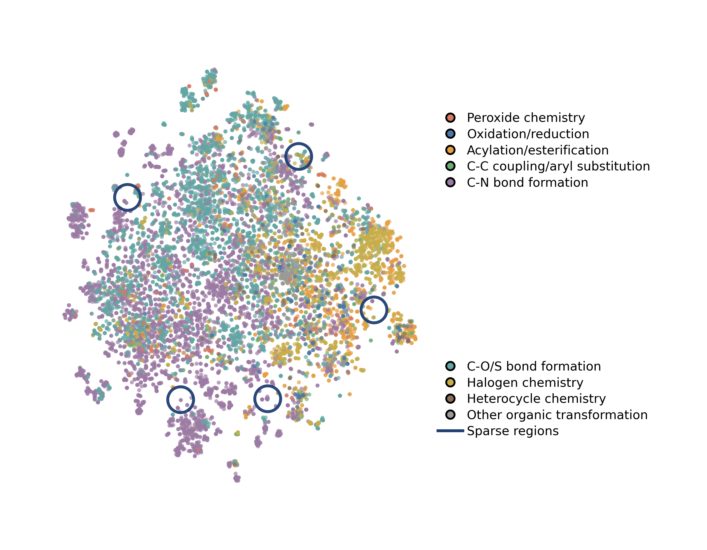
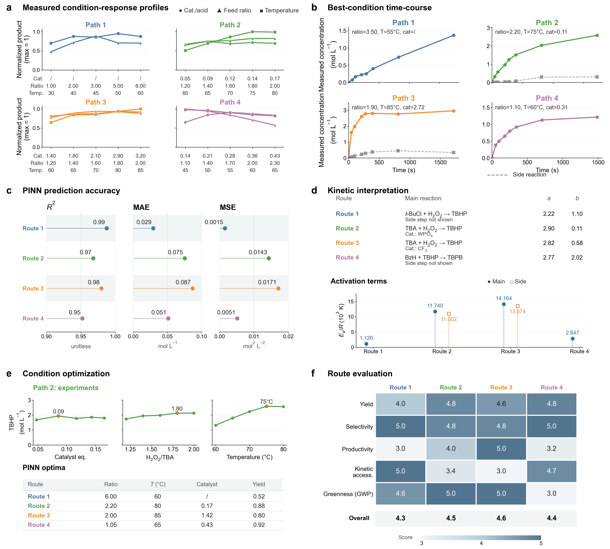

# KI-cLoop

**Closing the reaction-to-process loop with knowledge-intensified AI**

KI-cLoop is a knowledge-intensified closed-loop framework that connects a
provenance-aware chemical process knowledge graph (KI-CPG), traceable
graph-based retrieval, automated flow experimentation, physics-informed
kinetic inference, and reactor-scale analysis. This repository contains the
latest knowledge-graph/RAG, application-index, kinetics write-back,
evaluation, and figure-generation code used by the project, with superseded
copies and local-only artifacts removed.

The Python package remains named `kg_rag` for compatibility with existing
imports. Within KI-cLoop, it implements the graph-retrieval and structured
question-answering layer rather than the entire experimental and reactor
simulation stack.


## Main components

| Path | Purpose |
|---|---|
| `kg_rag/` | Core KG retrieval, hosted/local LLM workflows, materials and organic-reaction QA |
| `kg_rag/vectorDB/` | Vector-store, application-index, and kinetics-knowledge builders |
| `evaluation/` | Current Q1-Q6 benchmark, baseline collection, local KGRAG evaluation, and judging |
| `scripts/` | Portable Qwen LoRA fine-tuning and inference entry points |
| `figures/` | Latest compact raster figures and their regeneration scripts |
| `data/` | Compact processed PINN kinetics data plus the private-data policy |

## Installation

Python 3.10 is recommended. The legacy KG-RAG runtime and the modern
OpenAI-compatible evaluation client require different OpenAI package versions,
so use separate environments.

Core retrieval and local-model workflow:

```bash
python -m venv .venv-core
source .venv-core/bin/activate
pip install -r requirements-core.txt
```

Hosted-model evaluation:

```bash
python -m venv .venv-eval
source .venv-eval/bin/activate
pip install -r requirements-evaluation.txt
```

## Configuration

Portable defaults are in `kg_rag/config.yaml`. Relative paths are resolved
from the repository root. For a private machine-specific configuration, copy
the file outside the repository and set:

```bash
export KGRAG_CONFIG=/secure/path/config.yaml
```

API keys must be supplied through environment variables or an untracked env
file. See `.env.example`; never place credentials in committed YAML or source
files.

## Data and regeneration

A compact processed ODE-inverse PINN dataset is included under
`data/kinetics/`. It contains fitted kinetic parameters, model metrics,
uncertainty outputs, condition recommendations, and experimental-versus-model
prediction tables for the four routes. The graph-ready export is committed as
`data/kinetics_route_knowledge.json`.

Large, licensed, and sensitive source data remains absent. Put local source
data under an ignored location in `data/`, or point the environment variables
in `.env.example` to storage outside this repository.

Build the organic-reaction context with application labels:

```bash
python -m kg_rag.vectorDB.augment_or_applications
```

Export compact kinetics knowledge from pipeline outputs:

```bash
KGRAG_KINETICS_OUTPUTS=/path/to/kinetics/outputs \
python -m kg_rag.vectorDB.export_kinetics_context
```

Build MOF and organic-reaction Chroma stores:

```bash
python -m kg_rag.vectorDB.create_vectordb
python -m kg_rag.vectorDB.create_vectordb_or
```

The exact expected files and their producers are listed in
[`data/README.md`](data/README.md).

## Evaluation

The small Q1-Q6 benchmark is versioned because it is needed to describe and
test the current workflow. Generated answers and judge outputs are ignored.

```bash
cd evaluation

# Rebuild Q1-Q6 after regenerating the private local context files.
python build_updated_q1_q6.py

# Evaluate the local structured KGRAG workflow.
python evaluate_kgrag_pipeline.py --dataset-dir Q1-Q6

# Evaluate hosted baselines (requires provider API keys).
python evaluate_llms.py \
  --dataset-dir Q1-Q6 \
  --models "openai:gpt-5.5,qwen:qwen3.7-plus,deepseek:deepseek-v4-pro" \
  --output model_answers_updated.json
```

See [`evaluation/README.md`](evaluation/README.md) for judging and aggregation.

## LoRA fine-tuning

Model weights and training datasets are not tracked. The cleaned latest
training entry point accepts explicit paths:

```bash
python scripts/finetune_qwen_lora.py \
  --dataset /path/to/organic_synthesis_qa.json \
  --base-model Qwen/Qwen2-7B-Instruct \
  --output-dir checkpoints/or_lora

python scripts/infer_qwen_lora.py \
  "What are the operational steps for synthesizing ...?" \
  --adapter checkpoints/or_lora
```

## Figures

Only two compact, latest PNG outputs are kept; editable PowerPoint decks and
large generated point tables are excluded.





The scripts beside the images regenerate them when the private/source data is
available. Paths are configured through environment variables rather than
hard-coded workstation locations.

## Paper scope

The full paper workflow follows this sequence:

1. KI-CPG organizes material entities, physical quantities, process evidence,
   provenance, and confidence.
2. Graph-based RAG retrieves executable organic-peroxide route candidates.
3. Automated flow experiments produce time-resolved concentration data.
4. ODE-inverse physics-informed models infer route-specific kinetics and
   support condition selection.
5. Reactor-scale analysis converts kinetic knowledge into thermal and scale-up
   constraints.
6. Experimental and model-derived knowledge is written back into KI-CPG for
   subsequent retrieval and engineering decisions.

Private experimental records and proprietary reactor-model files are not part
of this repository. The included builders describe the interfaces used to
convert their outputs into retrievable knowledge.

